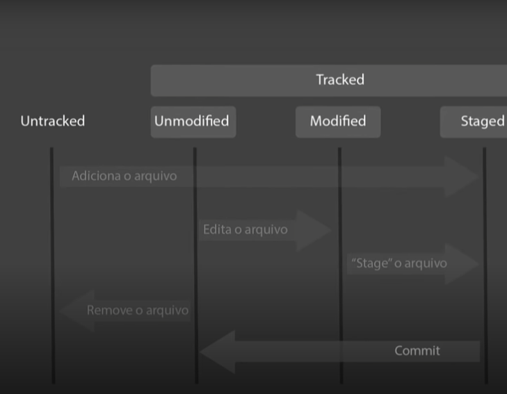

# Ciclo de vida github

- Tracked: São os arquivos que de fato estão rastreados pelo git
    - Unmodified: Arquivos que ainda não foram modificados
    - Modified: Arquivos que foram modificados
    - Staged: É onde ficam os arquivos que estão sendo preparados para poder fazer parte de um commit
- Untracked: São os arquivos que não estão rastreados pelo git

Exmplos práticos:

- Ao utilizar o git add  adicionamos arquivos que estavam Untracked direto para o Staged
- Os arquivos unmodified são arquivos presentes no repositório git que ainda não sofreram nenhuma alteração, Quando modificamos  ele muda automaticamente de Unmodified para Modified, ele faz esse processo comparando SHA1 se o SHA1 mudar significa que o arquivo foi modificado
- Se usarmos o git add nos aruivos modified ele irá novamente para o staged
- Se removermos um arquivo unmodified do repositório ele irá novamente para o Untracked
- Quando commitamos com git commit -m “” os arquivos ele se tornam unmodified, para recomeçar o ciclo, eles se tornam unmodified porque as modificações já foram salvas e a partir de agora esses arquivos serão a base de comparação para novas modificações e um novo ciclo.

